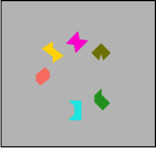

```{r setup, include=FALSE}
knitr::opts_chunk$set(echo = TRUE)
```

I'm currently finishing off my PhD at the University of Edinburgh under the supervision of <a href="http://www.ppls.ed.ac.uk/psychology/people/robert-logie" target="_blank">Professor Robert Logie</a>, <a href="http://www.hw.ac.uk/schools/life-sciences/staff-directory/mario-parra-rodriguez.htm" target="_blank">Dr Mario Parra</a> and <a href="http://www.ppls.ed.ac.uk/people/nelson-cowan" target="_blank">Professor Nelson Cowan</a>.

<br></br>

<div style="text-align: center"></div>

<br></br>

My research interests lie in models of short-term/ working memory and their potential application to practical problems, such as the early identification of disease. I am also interested in the more foundational issues of measurement and modelling of behaviour. My PhD thesis focuses on the apparent *absence* of a specific age-effect on the ability to associate object features (e.g. colour and shape) in visual working memory and its potential boundary conditions. Throughout there was a particular focus on the methodological issues associated with testing group differences in recognition memory.

